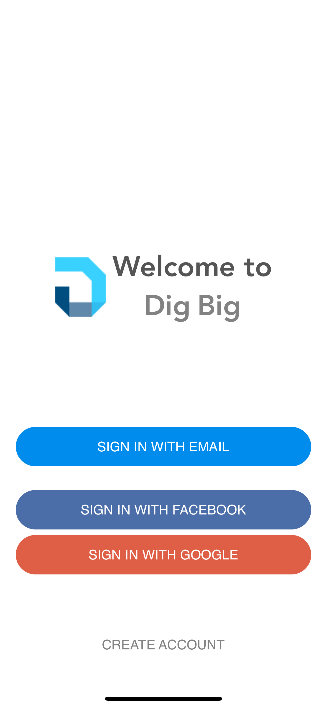
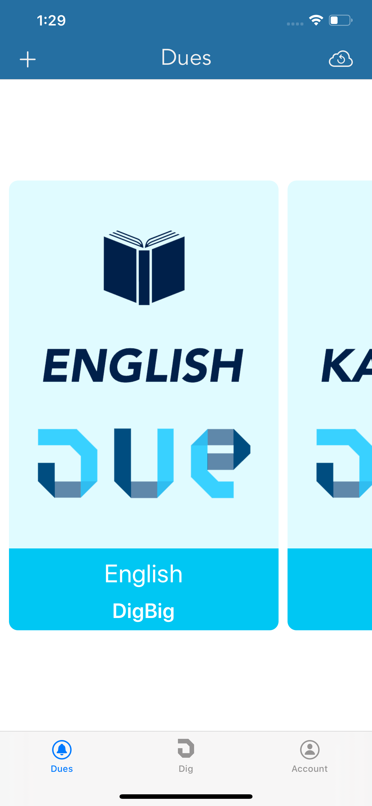
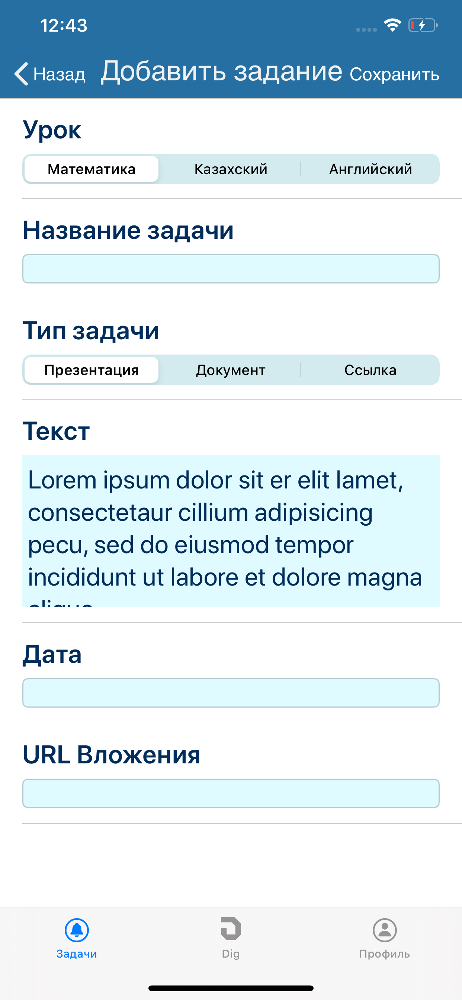
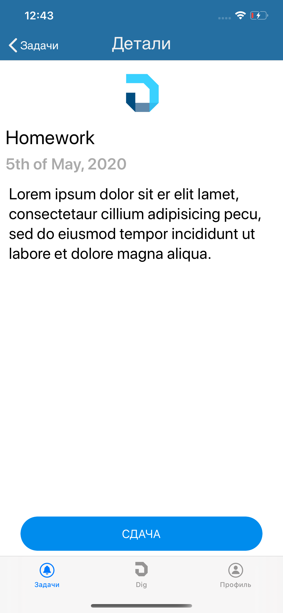
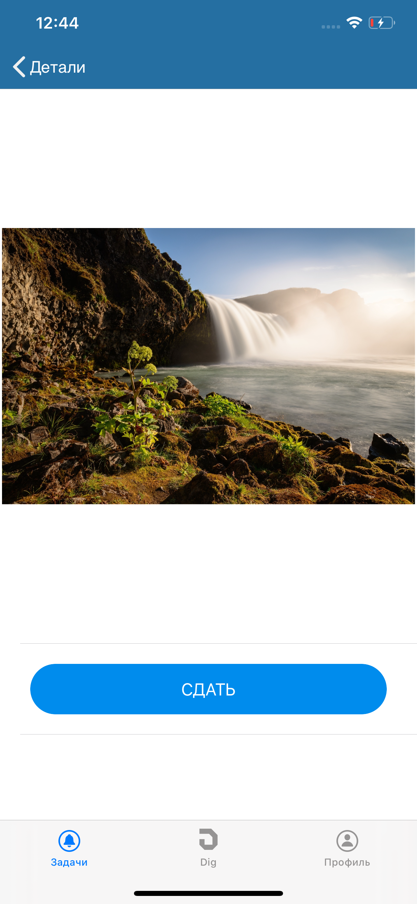
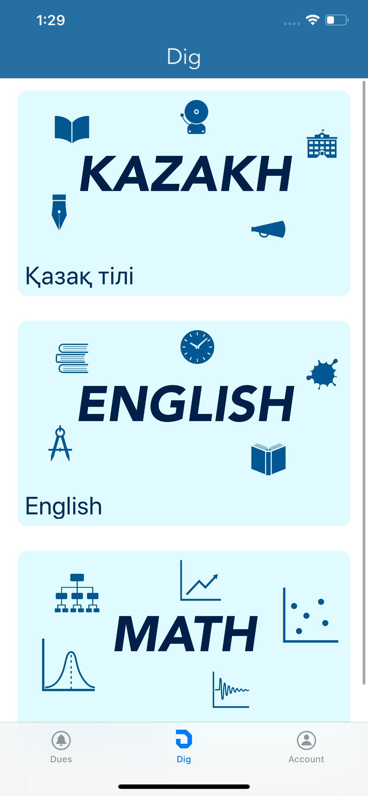
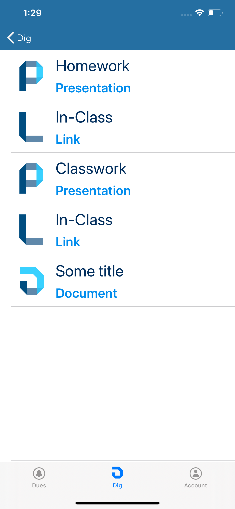
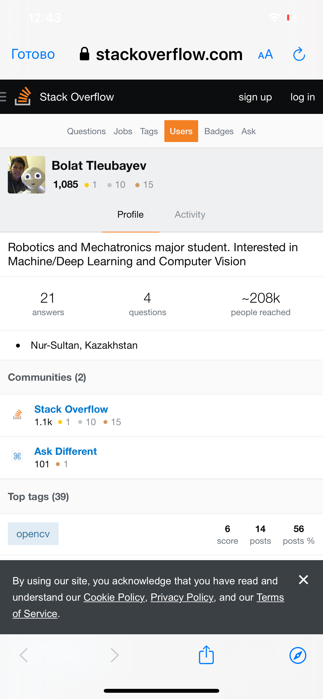
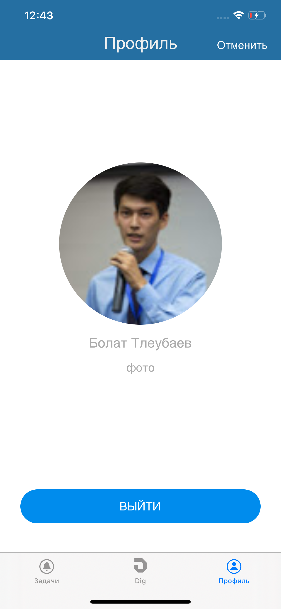

# DigBig

### About

This project was done for ideaTHON 2020 by NU Alumni Union in May 2020. The project was ranked 5th out of 15 teams by the jury team.

The application was done in Swift using Firebase, it was localized for Russian language. Also the keys for Facebook, Google, and Firebase APIs were removed, so to run the an you will need to use your own

* _The Launch Screen_ contains only logo on empty background.

* _The Login Screen_ contains different login options that are implemented using Firebase, Facebook, and Google APIs.

Below you can see the launch and the login screens.

  
  

* _The Dues Tab_ shows a list of tasks due, those tasks can be added and updated with bar buttons. Also user can upload a photo to Firebase Database.

Below you can see the Dues tab screenshots.

  
  
  
  

* _The Dig Tab_ shows a list of course materials you can view data in the links using Safari Controller.

Below you can see the Dig tab screenshots.

  
  
  

* _The Profile Tab_ the avatar and profile name of the logged in user.

Below you can see the Profile screen.

  

Click on image below to be redirected to the YouTube demos:

